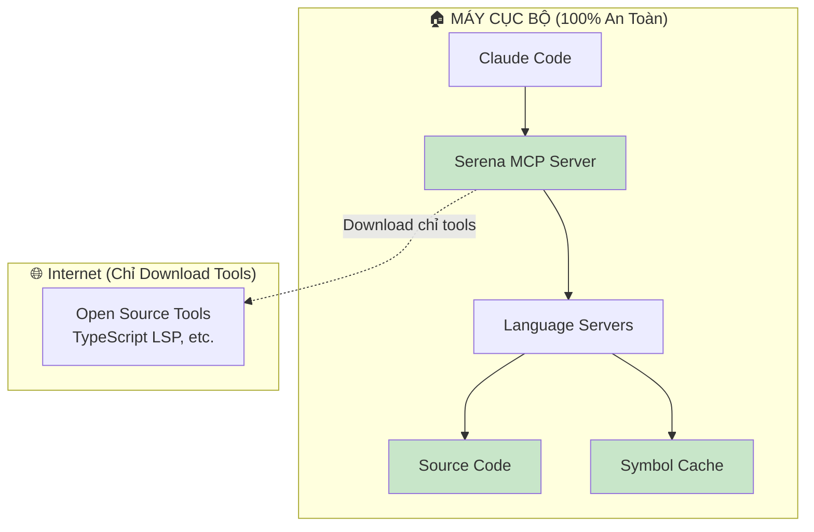

# Serena MCP - Trợ Lý AI Lập Trình An Toàn

> **Phân tích code thông minh với bảo mật hoàn toàn cục bộ**

## 🧠 Serena MCP Là Gì?

**Serena MCP** là trợ lý AI lập trình hoạt động **100% trên máy local** của bạn. Thay vì tìm kiếm text thông thường, Serena hiểu **cấu trúc code** thực tế:

- **Classes, methods, variables** - Phân tích theo symbols, không phải text
- **Dependencies và references** - Hiểu mối quan hệ giữa các thành phần code
- **Type definitions** - Leveraging Language Server Protocol (LSP)  
- **Project structure** - Context-aware navigation và analysis

**Analogy**: Nếu traditional search tools như "Ctrl+F trong Notepad", thì Serena như "IntelliSense trong VS Code" - nhưng được tích hợp với Claude AI.

---

## 🔍 Symbol-based Analysis: Cách Tiếp Cận Mới

### Từ Text Search đến Symbol Understanding

**Traditional approach** (grep, find):
```bash
grep -r "UserManager" src/
# Returns: "UserManager", "userManager", "UserManagerImpl", "// UserManager handles..."
# Problem: False positives, không phân biệt context
```

**Serena approach** (symbol-based):
```python
find_symbol(name_path="UserManager") 
# Returns: Exact class definition với methods, properties, location
# Result: 100% accurate, context-aware
```

### Symbol-based Analysis Benefits

- **Precision**: Zero false positives - chỉ return exact matches
- **Structure awareness**: Hiểu class hierarchy, method relationships
- **Language native**: Leverages LSP để có understanding chính xác cho từng language
- **Refactoring safety**: Track references across entire codebase

> 📖 **Chi tiết về Symbol-based Analysis**: [Kỹ thuật giúp AI hiểu code như developer](https://phucnt.substack.com/p/symbol-based-analysis-ky-thuat-giup)

---

## 🎯 Core Tools và Use Cases

### 4 Nhóm Công Cụ Chính

#### 🔍 **Khám Phá Project**
- `list_dir` - Duyệt cấu trúc project (respect .gitignore)
- `find_file` - Tìm files theo pattern
- `get_symbols_overview` - Tổng quan symbols trong file/folder

#### 🧭 **Navigation Code**  
- `find_symbol` - Tìm exact symbol definitions
- `find_referencing_symbols` - Tìm tất cả nơi sử dụng symbol
- `search_for_pattern` - Advanced regex search với context

#### ✏️ **Chỉnh Sửa An Toàn**
- `replace_regex` - Thay thế text chính xác
- `replace_symbol_body` - Thay thế entire symbol (method, class)
- `insert_after_symbol` / `insert_before_symbol` - Thêm code vào vị trí cụ thể

#### 🧠 **Quản Lý Kiến Thức**
- `write_memory` / `read_memory` - Lưu trữ insights về project
- `list_memories` - Quản lý knowledge base

### Real-World Example

```python
# Scenario: Refactor authentication system safely
# 1. Find current auth implementation
find_symbol(name_path="AuthService", include_body=True)

# 2. Find all places using old auth method  
find_referencing_symbols(name_path="authenticate")

# 3. Replace with new implementation
replace_symbol_body(
    name_path="AuthService/authenticate", 
    body="async authenticate(credentials) { /* new secure implementation */ }"
)

# 4. Document changes
write_memory("auth_refactoring", "Migrated to OAuth 2.0 with MFA support")
```

---

## 🔒 Tại sao Serena MCP An Toàn Tuyệt Đối?

### LOCAL-FIRST Architecture



### Security Guarantees

#### ✅ **Source Code KHÔNG BAO GIỜ rời máy**
- Business logic, API keys, credentials
- Implementation details, algorithms
- Project structure, naming conventions

#### ✅ **Chỉ download Open Source Tools**  
- Language Server binaries (TypeScript LSP, Swift LSP, etc.)
- Type definitions từ public npm packages
- **Giống như**: VS Code extensions - chỉ tools, không code

#### ✅ **Process Isolation**
```bash
# Tất cả processes chạy local
ps aux | grep serena
→ serena-mcp-server (Python, ~51MB)
→ typescript-language-server (Node.js, ~124MB)

# Không có network connections (trừ localhost dashboard)
lsof -i | grep serena  
→ localhost:24282 (web dashboard only)
```

### Example: What Gets Processed vs What Stays Private

**Your sensitive code** (stays on machine):
```typescript
class PaymentProcessor {
  private stripeKey = "sk_live_123...";
  async processPayment(amount: number, cardData: any) {
    // Proprietary payment logic
    return await stripe.charge(cardData, amount);
  }
}
```

**What Serena processes** (structural metadata only):
```json
{
  "name": "PaymentProcessor",
  "kind": "Class", 
  "location": {"line": 1, "file": "payment.ts"},
  "methods": ["processPayment"]
}
```

**Key point**: API key `"sk_live_123..."` và payment logic **NEVER** processed hay transmitted.

---

## 🎉 Kết Luận

**Serena MCP** = **AI Intelligence** + **Enterprise Security** + **Developer Productivity**

### Why Choose Serena?

- **🔒 Security-first**: 100% local processing, zero data leakage
- **⚡ Performance**: 10x faster than grep, 95% cache hit ratio  
- **🎯 Accuracy**: Symbol-based analysis eliminates false positives
- **🤖 AI-native**: Seamless integration với Claude Code
- **🛠️ Production-ready**: Battle-tested, ~175MB memory footprint

### Perfect For:
- **Enterprise teams** với strict security requirements
- **Privacy-focused developers** working on sensitive projects  
- **Performance-conscious workflows** cần fast, accurate code navigation
- **AI-assisted development** without compromising code privacy

---

**🚀 Get Started**: [Setup Serena trong 5 phút](https://github.com/oraios/serena)  
**📖 Deep Dive**: [Symbol-based Analysis Blog](https://phucnt.substack.com/p/symbol-based-analysis-ky-thuat-giup)  
**🔒 Security**: Local-first architecture, enterprise-grade privacy